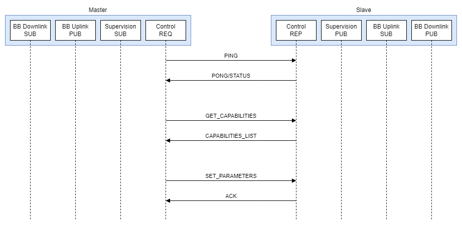

# Common Amateur Radio Interface (CARI)
**Author:** 
Wojciech Kaczmarski, SP5WWP 
M17 Foundation, 2025

## Protocol revision
The protocol described in this document is **CARI 1.1**.

## Abbreviations used in this document
BB   - Baseband 
BBU  - Baseband Unit 
CARI - Common Amateur Radio Interface 
CID  - Command Identifier 
CPRI - Common Public Radio Interface 
DL   - Downlink 
LNA  - Low Noise Amplifier 
PUB  - Publisher (ZeroMQ node type) 
REP  - Reply (ZeroMQ node type) 
REQ  - Request (ZeroMQ node type) 
RL   - Return Loss 
RRU  - Remote Radio Unit 
SUB  - Subscriber (ZeroMQ node type) 
UL   - Uplink 
ZMQ  - ZeroMQ 

## Introduction
CARI protocol is supposed to mimic professionally used *Common Public Radio Interface* (CPRI)
and offer a part of its functionality.
The protocol allows for basic data, control and supervision plane access, letting the user directly control
radio devices over a given medium. [ZeroMQ](https://zeromq.org/) is used for all data transfers. 

### Devices
A *CARI device* is any electronic device capable of supporting these functions:
* bi-directional medium access (mandatory for all devices)
* translation of digital signals into radio frequency domain and *vice versa* (mandatory for slaves)

Therefore, a RRU (slave) will combine both, while the BBU (master) will support only the first function.
Devices can be either masters or slaves, role mixing is not possible (one role per device).

### Subdevices
Transmitters and receivers within a single slave device are called *subdevices*.
There can be a maximum of 256 subdevices per device.

**Figure 1** - Device structure

### Basic topology
The interface assumes there are at least two devices connected over some physical medium:
* at least one master
* at least one controlled device (slave)

The connection between two or more devices is called a *network*.
A single network can consists of multiple masters and slaves.
Since there is no device addressing, the physical layer must be able to provide it.

**Figure 2** - Basic master-slave transaction

### Data flow and the Control Planes
There are 4 paths for the data flow, called *planes*:
* baseband uplink (*UL*)
* baseband downlink (*DL*)
* control (*CTRL*)
* supervision (*SPVN*)

#### Baseband uplink/downlink
Connections through the uplink and downlink planes can be established only when required.
Baseband streams are managed by ZMQ PUB-SUB pairs.

#### Data transactions over the Control Plane (CTRL)
A *data transaction* is any event of data exchange between the master and a slave device.
It consists of a *command* and a *reply*.

Control plane is used for setting radio equipment's parameters, such as oscillators' frequencies and RF signals' power levels.
This path uses a ZMQ REP-REQ pair. 

For multi-oscillator devices, there can be more than one pair of baseband UL/DL streams.

**Note:** CARI connection type over the Control Plane is point-to-point. Only one slave device can be addressed within a single transaction.
To set desired parameters of multiple devices, it is required to issue several commands.

#### Supervision
Supervision plane gives access to various telemetry data, including chassis temperature, reflected RF power, RL, etc.
The slave device offers telemetry data over its ZMQ PUB instance. 

#### Example master-slave connection
In the example below, the Baseband Unit (BBU) acts as a master over the Remote Radio Unit (RRU).

**Figure 3** - Example master-slave connection

### Command-reply
A *command* is a sequence of bytes sent by the master device, executing a particular action
at the controlled device. Every command has a command identifier (*CID*) assigned to it. 
A *reply* is a similar sequence sent back by the controlled device as an acknowledgement.
Replies may contain return values for error signalling. 
Subdevices can be accessed independently and are addressed using a single byte.

#### Command format
| CID        | Byte count field |
|------------|------------------|
| 1 byte     | 2 bytes          |

**Table 1** - Simple command/reply with no addressing or parameters (eg. *ping/pong*)

| CID        | Byte count field | Parameters       |
|------------|------------------|------------------|
| 1 byte     | 2 bytes          | 0 .. 65532 bytes |

**Table 2** - Command/reply with a parameter

| CID        | Byte count field | Address* | Parameters       |
|------------|------------------|----------|------------------|
| 1 byte     | 2 bytes          | 1 byte   | 0 .. 65531 bytes |

**Table 3** - Command/reply with addressing and parameters

\*Address of either a register or subdevice.

The reply for a command uses the same value in its ID field.
Byte count is little-endian and includes **all** bytes in the sequence.

### Command list
| CID     | Byte count | Action                                | Address    | Parameters                             | Return value               | Reply byte count |
|---------|------------|---------------------------------------|------------|----------------------------------------|----------------------------|------------------|
| 0x00    | 3          | Ping/pong                             | -          | -                                      | 32-bit value (error flags) | 7                |
| 0x01    | 5          | Set device's register value           | register   | 8-bit value                            | 0/1                        | 4                |
| 0x02    | varies     | Set subdevice's parameter             | subdevice  | 8-bit parameter ID, value (varies)     | 0/1                        | 4                |
| 0x03    | 5          | Execute subdevice's action            | subdevice  | 8-bit action ID                        | 0/1                        | 4                |
| 0x04    | varies     | SUB connect to BB UL PUB              | subdevice  | master's address as a string*          | 0/1                        | 4                |
| 0x05    | 6          | Initiate BB DL PUB stream             | subdevice  | 16-bit port number                     | 0/1                        | 4                |
| 0x06    | varies     | Initiate Supervision PUB stream       | subdevice  | 16-bit port number, parameters list**  | 0/1                        | 4                |

**Table 4** - *WRITE* command list

\*The string does not have to be null-terminated (eg. "tcp://192.168.0.69:1337"). 
\**Data transfer ceases when the parameters list is empty.

| CID     | Byte count | Action                                | Address    | Parameters           | Return value                   | Reply byte count |
|---------|------------|---------------------------------------|------------|----------------------|--------------------------------|------------------|
| 0x80    | 3          | Get *IDENT* string                    | -          | -                    | *IDENT* string                 | varies           |
| 0x81    | 4          | Get register value                    | register   | -                    | 8-bit value                    | varies           |
| 0x82    | 4          | Get subdevice capabilities list       | subdevice  | -                    | list of capabilities           | varies           |
| 0x83    | 5          | Get subdevice parameter               | subdevice  | 8-bit parameter ID   | value of a selected parameter  | varies           |
| 0x84    | 4          | Get Supervision parameters list       | -          | -                    | list of supported quantities   | varies           |

**Table 5** - *READ* command list

All values are little-endian. Return value of 0 means success, any other value is an error code (see **Table 6** for details).
Parameter of 0 disables the function, 1 enables it.

### Reply error codes
| Value    | Meaning                  |
|----------|--------------------------|
| 0        | No errors                |
| 1        | Malformed frame          |
| 2        | Unsupported command      |
| 3        | ZMQ port bind failed     |
| 4        | ZMQ connection failed    |
| 5        | Value out of range       |
| 6 .. 255 | Reserved                 |

**Table 6** - Reply error codes

### Device error flags
| Bit      | Meaning                                        |
|----------|------------------------------------------------|
| 0 (LSB)  | PLL lock error                                 |
| 1        | Subdevice communication error                  |
| 2        | Temperature out of allowed range               |
| 3        | Frequency reference unavailable                |
| 4 .. 30  | Reserved                                       |
| 31 (MSB) | Reserved                                       |

**Table 7** - Device error flags

### Config/info register access
**Note:** Some registers are write-only. All values are 8-bit (single byte).

| Register address | Description                           | Access |
|------------------|---------------------------------------|--------|
| 0x00             | CARI version support                  | R      |
| 0x01             | Number of subdevices                  | R      |
| 0x02 .. 0xFF     | User-defined space                    | R/W    |

**Table 8** - Register address map

#### CARI version support
This field holds supported CARI protocol version as `(major<<4)|minor`.

### Device's capabilities
| Capability ID | Meaning                                      |
|---------------|----------------------------------------------|
| 0x00          | Baseband stream compression available        |
| 0x01          | Supervision channel available                |
| 0x02 .. 0xFF  | Reserved                                     |

**Table 9** - Capabilities (device)

### Subdevice's capabilities
Most capabilities are explicit - if its ID appears in the list - it is supported:

| Capability ID | Meaning                                      |
|---------------|----------------------------------------------|
| 0x00          | I/Q modulation available                     |
| 0x01          | Receiver                                     |
| 0x02          | Transmitter                                  |
| 0x03          | Full duplex available                        |
| 0x04          | Automatic Gain Control available             |
| 0x05          | Automatic Frequency Control available        |
| 0x06          | Frequency reference available                |
|               |                                              |
| 0x07          | Amplitude demodulator avaialble              |
| 0x08          | Frequency demodulator available              |
| 0x09          | Phase demodulator available                  |
| 0x0A          | Single-sideband demodulator available        |
|               |                                              |
| 0x0B          | Amplitude modulator avaialble                |
| 0x0C          | Frequency modulator available                |
| 0x0D          | Phase modulator available                    |
| 0x0E          | Single-sideband demodulator available        |
| 0x0F .. 0x7F  | Reserved                                     |

**Table 10a** - Capabilities (subdevice)

Some capabilities can represent a range:

| Capability ID | Meaning          | Unit         | Size (bytes)   |
|---------------|------------------|--------------|----------------|
| 0x80          | Frequency        | Hz           | 8 (unsigned)   |
| 0x81          | LNA gain         | dB           | 4 (float)      |
| 0x82          | Power            | dBm          | 4 (float)      |
| 0x83          | Channel width    | Hz           | 4 (float)      |
| 0x84          | Sample rate      | Hz           | 4 (float)      |
| 0x85 .. 0xFF  | Reserved         | -            | -              |

**Table 10b** - Capabilities (subdevice)

#### Expressing value ranges
Capabilities with addresses greater than or equal 0x80 can be used to represent a certain range.
To express a range for a given field (eg. power, frequency, gain),
two consecutive capability ID-value pairs should be transmitted:

`... | Capability ID | Value - low | Capability ID | Value - high | ...`

### Subdevice parameters
Parameters are used to configure subdevices.

| Parameter ID  | Meaning                                      | Size (bytes)   | Unit     |
|---------------|----------------------------------------------|----------------|----------|
| 0x00          | Frequency                                    | 8 (unsigned)   | Hz       |
| 0x01          | LNA gain                                     | 4 (float)      | dB       |
| 0x02          | Output power                                 | 4 (float)      | dBm      |
| 0x03          | Channel width                                | 4 (float)      | Hz       |
| 0x04          | Sample rate                                  | 4 (float)      | Hz       |
| 0x05          | Frequency correction                         | 4 (float)      | ppm      |

**Table 11** - Subdevice parameters

### Subdevice actions
| Action ID     | Action                                   |
|---------------|------------------------------------------|
| 0x00          | Reception start (initiate baseband DL)   |
| 0x01          | Reception stop (stop baseband DL)        |
| 0x02 .. 0xFF  | Reserved                                 |

**Table 12** - Subdevice actions

### Supervision plane - data format
The data published over the Supervision Plane is grouped into packets: 
`Quantity ID | Value | Quantity ID | Value | ...` 
Data packets are transmitted repeatedly.

#### Quantities
| ID       | Quantity                         | Size (bytes)   | Unit        | Remarks                                                |
|----------|----------------------------------|----------------|-------------|--------------------------------------------------------|
| 0x00     | Temperature                      | 4 (float)      | deg. C      | Measured at the RF unit?                               |
| 0x01     | Voltage                          | 4 (float)      | V           | Measured at the RF unit?                               |
| 0x02     | Current                          | 4 (float)      | A           | Total current draw by the device, DC side              |
| 0x03     | Return Loss                      | 4 (float)      | dB          | The value has to be prepended with a subdevice address |
| 0x04     | RF power (incident, average)     | 4 (float)      | dBm         | The value has to be prepended with a subdevice address |
| 0x05     | RF power (reflected, average)    | 4 (float)      | dBm         | The value has to be prepended with a subdevice address |

**Table 12** - Supervision plane - supported quantities

## Basic setup
Basic subdevice setup is shown in *Figure 3*.

**Figure 4** - Basic subdevice setup
